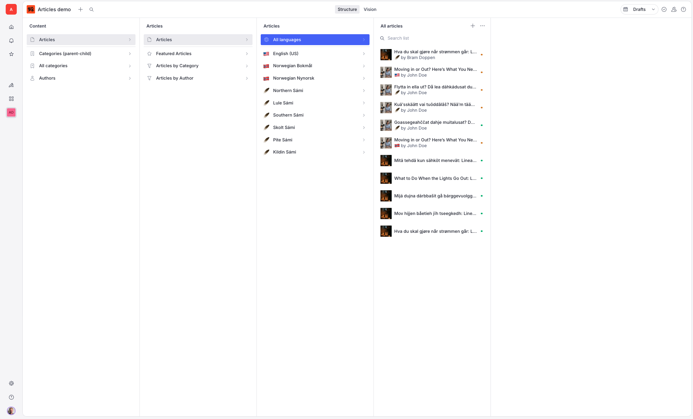
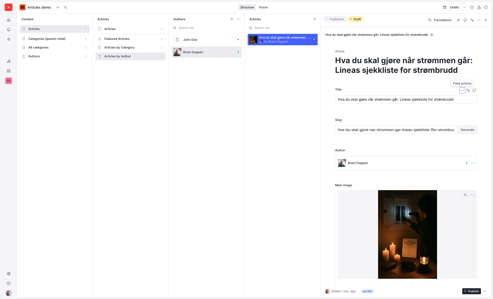

# Articles Studio Demo: Structured Content Modeling & Translation in Sanity Studio

This repository showcases **multiple approaches to structuring and displaying content** within Sanity Studio. The primary goal is to demonstrate how a single content model—composed of `articles`, `authors`, and `categories`—can be surfaced through a variety of editorial interfaces to support multilingual content creation and category relationships.


## 📸 Screenshots

### All Articles View



*All articles are listed in the main content pane, showing title, author, language, and featured status.*

---

### Filtered by Author



*Articles are filtered to show only those written by a selected author, demonstrating the author filter functionality in the studio.*

### Articles by Author

This view allows editors to quickly filter and browse articles written by a specific author. Selecting an author from the list displays only their associated articles.

**How it works:**
- The left pane lists all authors.
- Selecting an author shows a filtered list of articles where the `author` reference matches the selected author.
- This is implemented in the Studio structure using a nested list:  
  - First, a list of authors is shown.
  - When an author is selected, a filtered document list displays only their articles.

**Example Studio Structure Code:**
```
// Inside your structure.ts
...
S.listItem()
  .title('Articles by Author')
  .icon(CiFilter)
  .child(
    S.documentTypeList('author')
      .schemaType('author')
      .title('Authors')
      .child((authorId) =>
        S.documentList()
          .title('Articles')
          .filter('_type == "article" && author._ref == $authorId')
          .params({ authorId })
      )
  )
...
```


---

## 🎯 Goals of this repo

- Demonstrate **flexible content modeling** with reusable types.
- Show how the same content can be surfaced through **different visual representations** in the studio.
- Provide working examples of **translation workflows** using Sanity’s document translation plugin AND field-level translation.
- Enable **filtering by fields** (e.g. language, author, category, featured status).
- Explore the **editor experience** and suggest areas for UX improvement (e.g. creation flow).

---

## 🔍 Core Content Types

- `author`: Simple contributor reference
- `authorColleciton`: Curated collection of articles. (not used yet)
- `category`: Self-referencing schema for parent-child relationships
- `article`: Multilingual content, with translation logic and metadata

All types are intentionally kept minimal to focus on structural relationships and editorial experience.

---

## 🌐 Translations

Articles use the [document translation plugin](https://www.sanity.io/plugins/document-internationalization) to manage multilingual versions.

- Editors can open a document side-by-side with its translation
- Translation is triggered via a button and populated using AI action
- Editors can leave the translation process and return later
- Language filtering tabs provide a quick way to inspect all translated content

There is also [field-level translation](https://www.sanity.io/plugins/internationalized-array) configured, primarely used on the bio of the author, and the name of the category.

---

## 🧭 Filtering & Intent-based Navigation

- Articles can be filtered by:
  - Language
  - Author
  - Category (including nested categories)
  - Featured status
- Intent-based links can be extended in the future 

> 💡 _The demo currently uses basic filters and views, but future versions can improve navigation logic_

---


## 📦 Getting Started

```bash
git clone <this-repo>
cd <this-repo>
pnpm install
pnpm run dev
